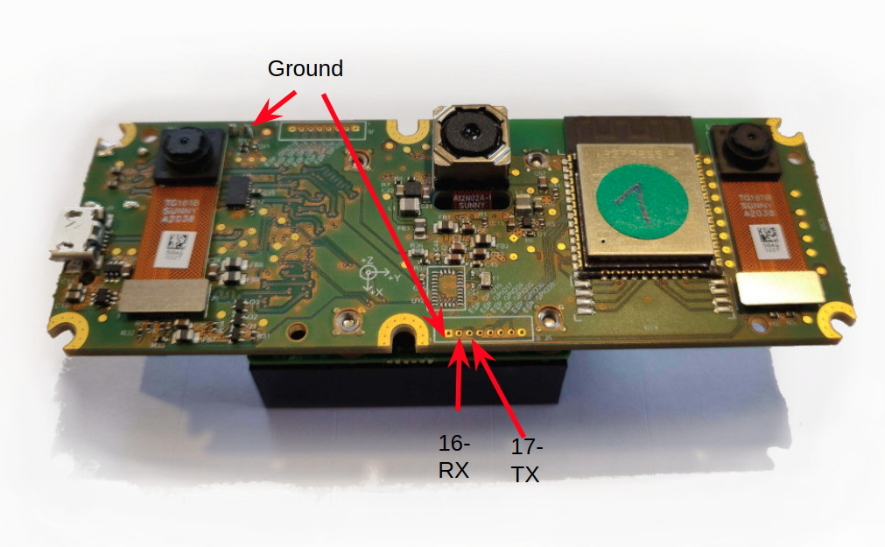

# Follow Me

```diff
- This feature is only meant to be used for testing and development purposes.
- I will not be responsible for any damage or injury.
- Please do not try this example if you are not well versed with ArduPilot
```

## Running example on IOT devices

1. Plug in the camera using the supplied USB-C cable to your computer (Also attach the power cable to your wall outlet)

2. Inside the project directory (while the camera is connected) run:
```bash
python3 main.py
```
3. A OpenCV window should pop up with the Cameras RGB view on it.

4. This view is divided in a 3x3 grid (not evenly distributed to avoid noise on the edges as well as the ground plane below, while taking off). The smallest distance on each grid should be printed on the screen.

5. If the above script works well, you can flash the pipeline to the camera so that a companion computer isn't required anymore.
Update the bootloader (only required once):
``` bash
python3 pipeline_uploader.py bootloader
```
Then upload the pipeline by running the command:
``` bash
python3 pipeline_uploader.py
```

6. Wait for a few seconds. Once the flash is complete, you should hear a "click" sound and the camera will automatically run the script every time it is powered up.

## Setting up ESP32

1. Connect the ESP32 via USB-B cable to your computer.

2. Setup the IDF environment via the guide [here](https://docs.espressif.com/projects/esp-idf/en/v4.2.2/esp32/get-started/index.html). If you are on Linux you might need to run (make sure you do this in a separate terminal as this opens up a virtual env):
```bash
. $HOME/esp/esp-idf/export.sh
```
3. Upload the script to ESP32. Make sure you enter the right port for the ESP32.
```bash
idf.py -p /dev/ttyUSB0  flash monitor
```
4. You should see the coordinates being printed on the screen, of the shortest distances of each grid. If its printed, your setup is working!

## Setting up ArduPilot

1. Connect the Serial Pins and Ground to any serial port on your Flight Controller as shown below.


2. Setup the following parameters:
- SERIALX_PROTOCOL = 2 (MAVLink)
- SERIAL4_BAUD = 115

3. Set up Simple Avoidance:
- PRX_TYPE = 2 (MAVLink)
- PRX_IGN_GND = 1 (If you have downward facing rangefinder. Otherwise make sure you install the camera in such a way that the ground isn't visible while take off. Otherwise the vehicle will start "avoiding" the ground below and can flip over)
- PRX_LOG_RAW = 1 (To enable raw logs for debugging later)
- AVOID_ENABLE = 3
- AVOID_MARGIN as per requirements
- Please enable a safety switch to turn off Avoidance at any moment via RC. More details given [here](https://ardupilot.org/copter/docs/common-simple-object-avoidance.html#safety-first)

4. Reboot

5. Open Mission Planner. Connect to the Flight Controller. Press Cntl + F to view the advanced menu. Click on "MAVLink Inspector"

6. If everything is set up well: A 1HZ Heartbeat should be visible there from a source ID "93". Also you should see "OBSTACLE_DISTANCE_3D" messages there as well with a high rate.

7. Inflight switch to Loiter mode. Turn on avoidance via safety switch (make sure its off before takeoff, especially for the first time). Bring a obstacle close to the camera and you should see the Copter backing away from it. Incase something is wrong, do not forget to turn off avoidance via safety switch.

